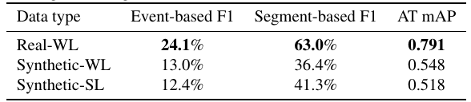
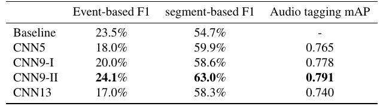
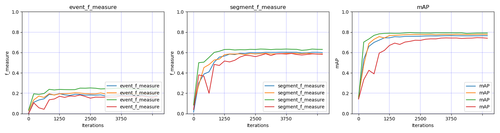
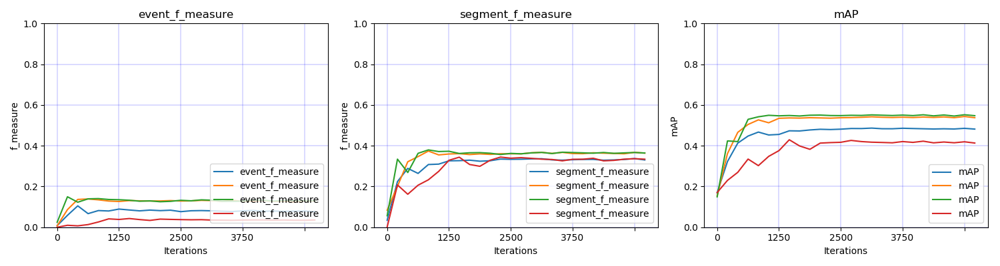
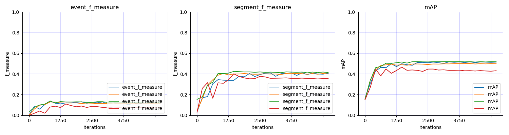

# DCASE2019 Task4 Sound event detection in domestic environments

DCASE2019 Task4 Sound Event Localization and Detection is a task to evaluate systems for the detection of sound events using real data either weakly labeled or unlabeled and simulated data that is strongly labeled (with time stamps). More description of this task can be found in http://dcase.community/challenge2019/task-sound-event-detection-in-domestic-environments.

## DATASET
The dataset can be downloaded from http://dcase.community/challenge2019/task-sound-event-detection-in-domestic-environments. The training data consists of real data with weak labels, synthetic data with strong labels and unlabelled data. All audio recordings are 10-second, either single-channel or two-channel and with a sample rate of 44.1 kHz. There are 10 sound classes to be detected such as 'Speech' and 'Dog'. The sound events can be polyphonic. 

The statistic of the data is shown below:

|      | Real audio with weak labels | Synthetic audio with strong labels | Unlabelled in domain audio | Validation audio |
|:----:|:---------------------------:|:----------------------------------:|:--------------------------:|:----------------:|
| Num. |             1578            |                2045                |            14412           |       1168       |

An example of log mel spectrogram and strongly labelled onset and offset events of an audio recording 'Y-0CamVQdP_Y_0.000_6.000.wav' from validation set is shown below:

## Run the code

**0. Prepare data** 

Download and upzip the data, the data should looks like:

<pre>
dataset_root
├── audio
│    ├── train
│    │    ├── weak (1578 files)
│    │    │    ├── Y02MGx1Vh9c0_240.000_250.000.wav
│    │    │    └── ...
│    │    ├── synthetic (2045 files)
│    │    │    ├── 1000.wav
│    │    │    └── ...
│    │    └── unlabel_in_domain (14412 files)
│    │         ├── Y009KWpkgLZc_0.000_10.000.wav
│    │         └── ...
│    └── validation (1168 files)
│         ├── Y02MGx1Vh9c0_240.000_250.000.wav
│         └── ...
└── metadata
     ├── train
     │    ├── weak.csv
     │    ├── synthetic.csv
     │    └── synthetic.csv
     └── validation
          ├── eval_dcase2018.csv
          ├── test_dcase2018.csv
          └── validation.csv
</pre>

**1. Requirements** 

python 3.6 + pytorch 1.0

**2. Then simply run:**

$ Run the bash script ./runme.sh

Or run the commands in runme.sh line by line. The commands includes:

(1) Modify the paths of dataset and your workspace

(2) Extract features

(3) Train model

(4) Inference

## Model
We apply convolutional neural networks using the log mel spectrogram of audio as input. For real data with weak labels, we apply clipwise binary crossentropy loss. For synthetic data with strong labels, we apply either clipwise binary crossentropy loss or framewise binary crossentropy loss. To train a CNN with 9 layers and a mini-batch size of 32, the training takes approximately 200 ms / iteration on a single card GTX Titan Xp GPU. The model is trained for 5000 iterations. The training looks like:

<pre>
Load data time: 2.691 s
Training audio num: 1578
Validation audio num: 1168
------------------------------------
...
------------------------------------
Iteration: 5000
validate statistics:
    Audio tagging mAP: 0.791
    Write submission file to /vol/vssp/msos/qk/workspaces/dcase2019_task4/_temp/submissions/main/logmel_64frames_64melbins/train/weak/loss_type=clipwise_binary_crossentropy/_submission.csv
    Event-based, classwise F score: 0.231, ER: 1.502, Del: 0.777, Ins: 0.725
    Segment based, classwise F score: 0.631, ER: 0.668, Del: 0.418, Ins: 0.250
Train time: 39.454 s, validate time: 17.954 s
Model saved to /vol/vssp/msos/qk/workspaces/dcase2019_task4/models/main/logmel_64frames_64melbins/train/weak/loss_type=clipwise_binary_crossentropy/md_5000_iters.pth
------------------------------------
...
</pre>

## Results

**Results of training on real weakly labelled data, synthetic weakly labelled data and synthetic strongly labelled data**

The results in the following table is based on the CNN9-I model which is a 9-layer CNN model with 2x2 average pooling. 

The table shows that training with real weakly lablled data achieves better results than training with synthetic data. 

**Results of different CNN architectures**

The baseline model is from the official website [2]. 

The table shows that the CNN9-II which is 9-layer CNN with 2x2 max pooling performs better than other models. 

**Train with real data and weak target:**

**Train with synthetic data and weak target:**

**Train with synthetic data and strong target**

**Visualization of prediction**

## Summary
This codebase provides a convolutional neural network (CNN) for DCASE 2019 challenge Task 4 Sound event detection in domestic environments. 

## Citation

**If this codebase is helpful, please feel free to cite the following paper:**

**[1] Qiuqiang Kong, Yin Cao, Turab Iqbal, Yong Xu, Wenwu Wang, Mark D. Plumbley. Cross-task learning for audio tagging, sound event detection and spatial localization: DCASE 2019 baseline systems. arXiv preprint arXiv:1904.03476 (2019).**

## FAQ
If you met running out of GPU memory error, then try to reduce batch_size. 

## External link

[2] http://dcase.community/challenge2019/task-sound-event-detection-in-domestic-environments

[3] https://github.com/turpaultn/DCASE2019_task4/tree/public/baseline/models
