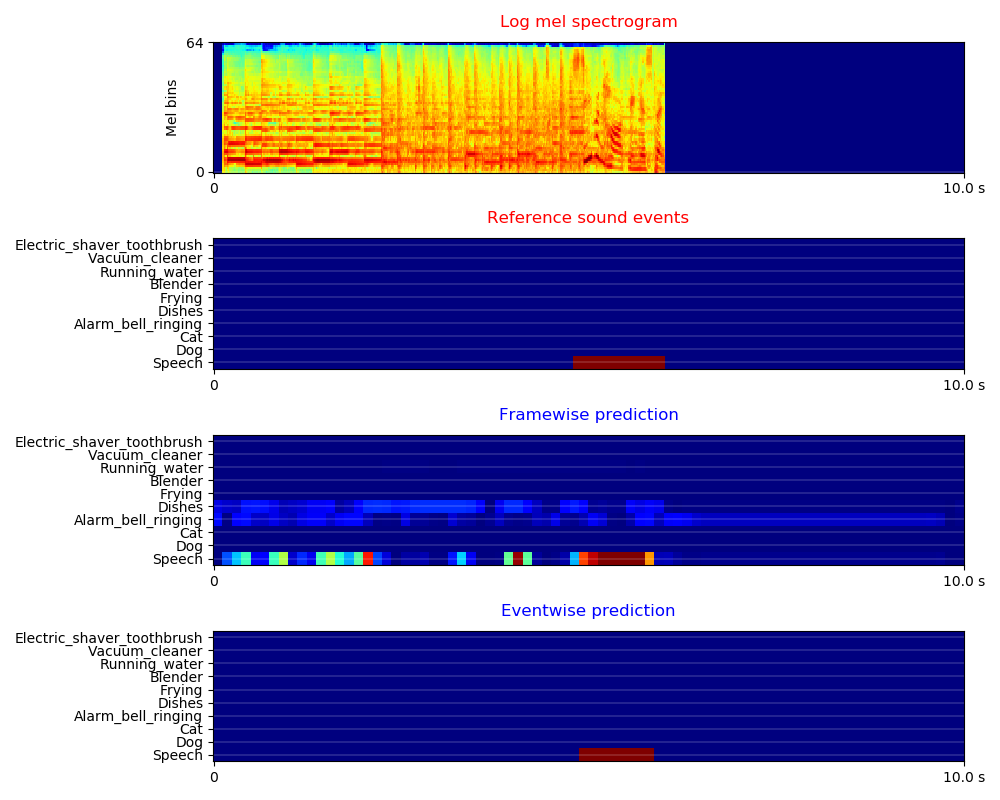
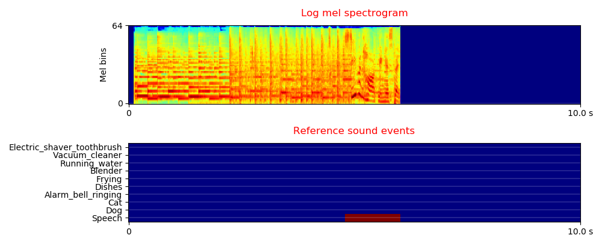

# DCASE2019 Task4 Sound event detection in domestic environments

DCASE2019 Task4 Sound Event Localization and Detection is a task to evaluate systems for the detection of sound events using real data either weakly labeled or unlabeled and simulated data that is strongly labeled (with time stamps). More description of this task can be found in http://dcase.community/challenge2019/task-sound-event-detection-in-domestic-environments.

## DATASET
The dataset can be downloaded from http://dcase.community/challenge2019/task-sound-event-detection-in-domestic-environments. The training data consists of real data with weak labels, synthetic data with strong labels and unlabelled data. There are 10 sound classes to be detected such as 'Speech' and 'Dog'. The sound events can be polyphonic. 

The statistic of the data is shown below:

|      | Real audio with weak labels | Synthetic audio with strong labels | Unlabelled in domain audio | Evaluation audio |
|:----:|:---------------------------:|:----------------------------------:|:--------------------------:|:----------------:|
| Num. |             1578            |                2045                |            14412           |       1168       |

The log mel spectrogram of the scenes are shown below:

## Run the code

**0. Prepare data** 

Download and upzip the data, the data should looks like:

<pre>
dataset_root
├── audio
│    ├── train
│    │    ├── weak (1578 files)
│    │    │    ├── Y02MGx1Vh9c0_240.000_250.000.wav
│    │    │    └── ...
│    │    ├── synthetic (2045 files)
│    │    │    ├── 1000.wav
│    │    │    └── ...
│    │    └── unlabel_in_domain (14412 files)
│    │         ├── Y009KWpkgLZc_0.000_10.000.wav
│    │         └── ...
│    └── validation (1168 files)
│         ├── Y02MGx1Vh9c0_240.000_250.000.wav
│         └── ...
└── metadata
     ├── train
     │    ├── weak.csv
     │    ├── synthetic.csv
     │    └── synthetic.csv
     └── validation
          ├── eval_dcase2018.csv
          ├── test_dcase2018.csv
          └── validation.csv
</pre>

**1. Requirements** 

python 3.6 + pytorch 1.0

**2. Then simply run:**

$ Run the bash script ./runme.sh

Or run the commands in runme.sh line by line. The commands includes:

(1) Modify the paths of dataset and your workspace

(2) Extract features

(3) Train model

(4) Inference

## Model
We apply convolutional neural networks using the log mel spectrogram of audio as input. For real data with weak labels, we apply clipwise binary crossentropy loss. For synthetic data with strong labels, we apply either clipwise binary crossentropy loss or framewise binary crossentropy loss. 

## Results
To train a CNN with 9 layers and a mini-batch size of 32, the training takes approximately 200 ms / iteration on a single card GTX Titan Xp GPU. The model is trained for 5000 iterations. The training looks like:

<pre>
Load data time: 2.691 s
Training audio num: 1578
Validation audio num: 1168
------------------------------------
...
------------------------------------
iteration: 5000
validate statistics:
    Audio tagging mAP: 0.791
    Write submission file to /vol/vssp/msos/qk/workspaces/dcase2019_task4/_temp/submissions/main/logmel_64frames_64melbins/train/weak/loss_type=clipwise_binary_crossentropy/_submission.csv
    Event-based, classwise F score: 0.196, ER: 1.384, Del: 0.826, Ins: 0.558
    Segment based, classwise F score: 0.606, ER: 0.674, Del: 0.460, Ins: 0.215
train time: 38.590 s, validate time: 15.896 s
Model saved to /vol/vssp/msos/qk/workspaces/dcase2019_task4/models/main/logmel_64frames_64melbins/train/weak/loss_type=clipwise_binary_crossentropy/md_5000_iters.pth
------------------------------------
...
</pre>

Validation result:
|                                       | Audio tagging mAP | Event based F score (macro average) | Segment based F score (micro average) |
|:-------------------------------------:|:-----------------:|:-----------------------------------:|:-------------------------------------:|
|            Official result            |         -         |                23.5%                |                 54.7%                 |
| Weak labeled audio with clipwise loss |       78.8%       |                22.4%                |                 61.3%                 |
|   Synthetic audio with clipwise loss  |       56.4%       |                12.3%                |                 38.6%                 |
|  Synthetic audio with framewise loss  |       50.8%       |                11.7%                |                 40.9%                 |

**Visualization of prediction**

## Summary
This codebase provides a convolutional neural network (CNN) for DCASE 2019 challenge Task 4 Sound event detection in domestic environments. 

## Citation
To appear. 

## FAQ
If you met running out of GPU memory error, then try to reduce batch_size. 

## License
MIT license. 

## External link

The official baseline system is here https://github.com/turpaultn/DCASE2019_task4/tree/public/baseline/models
